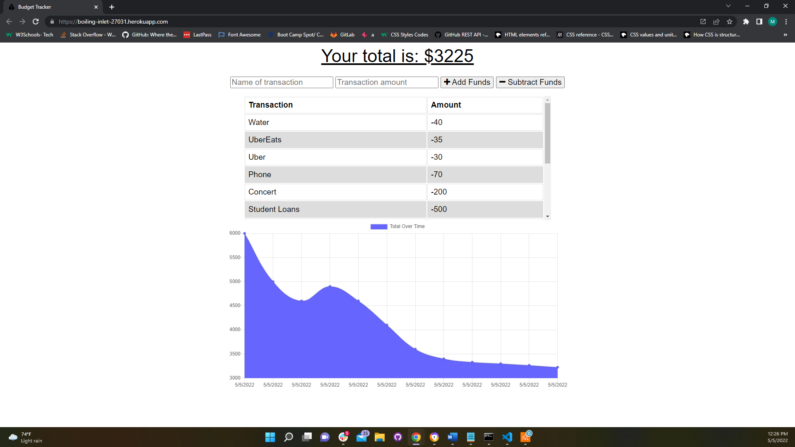
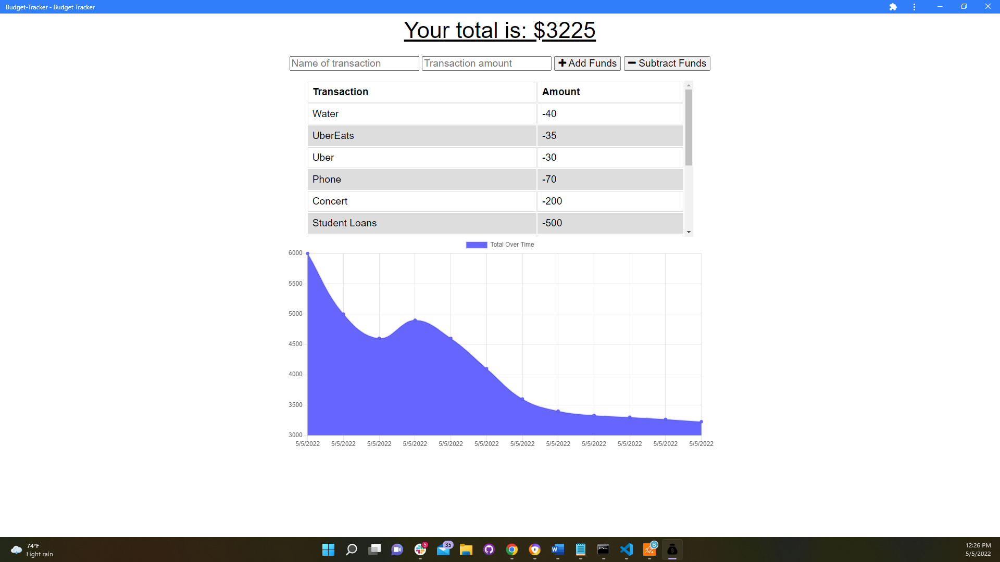

# Budget Tracker

## Description
This is a Progress Web Application (PWA) that allows users to keep track of their finances. Users are able to add expenses and deposits to their budget with or without a connection. If the user enters transactions offline, the total is updated when they return online. This application uses HTML, CSS, JavaScript, IndexedDB, MongoDB, and Express.js.

## User Story 
```
AS AN avid traveler
I WANT to be able to track my withdrawals and deposits with or without a data/internet connection
SO THAT my account balance is accurate when I am traveling 
```

## Screenshots

### Website


### Progress Web Application


## Table of Contents
* [Features](#features)
* [Installation](#installation)
* [Contributing](#contributing)
* [Deployed-Application](#deployed-application)
* [Questions](#questions)

## Features
This application has the following features:
1. When a user inputs a new expense or deposit, it is displayed on a chart and graph with previously entered transactions. Their new total is also calculated and displayed on the top of the screen.
2. When a user loses internet connection and inputs new transactions, the new transactions will added to IndexedDB until the user returns back online. 
3. Users can install this application to their desktop or mobile devices. 

## Installation
1. Clone the repository

```bash
git clone https://github.com/MuboHouston/budget-tracker.git
```

2. Change the working directory

```bash
cd budget-tracker
```

3. Install dependencies

```bash
npm install
```

4. Run the app

``` bash 
npm start
```

## Contributing 
Contributions, issues, and feature requests are welcome!

## Deployed-Application
https://boiling-inlet-27031.herokuapp.com/

## Questions
Find me on GitHub: https://github.com/MuboHouston
